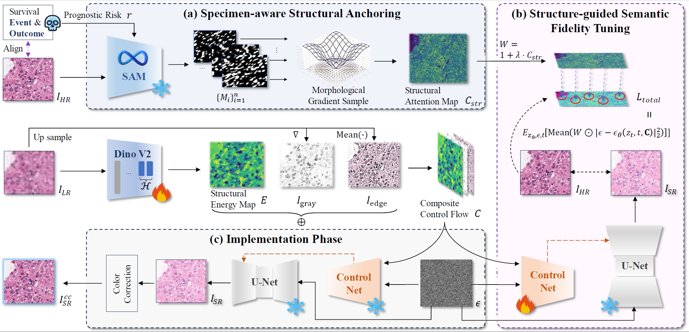
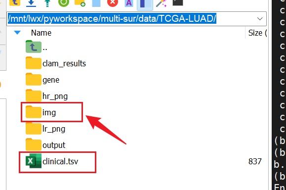
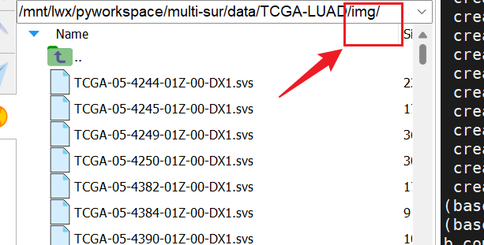
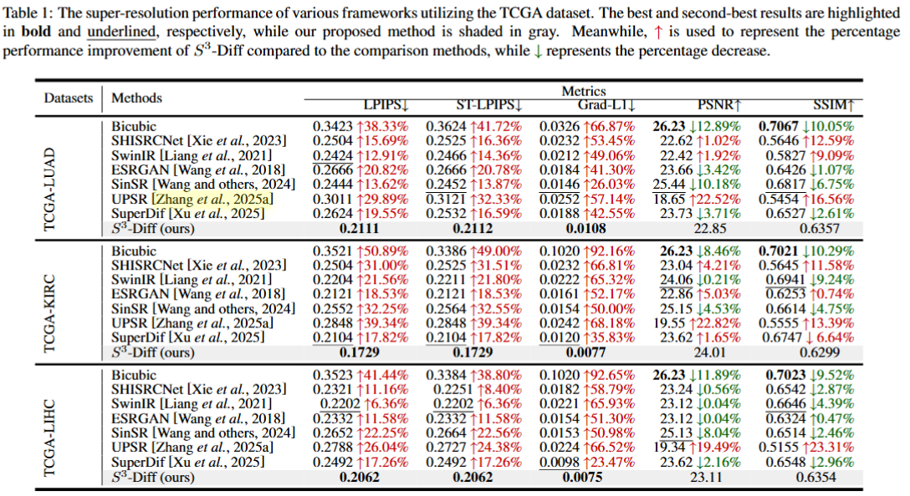
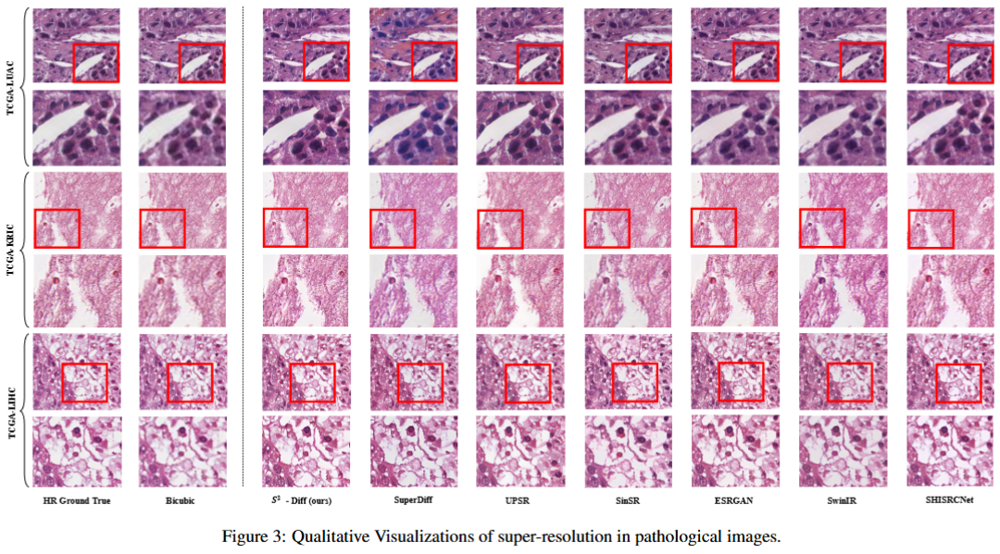

# $S^3$-Diff: Structural Semantic Synergy Diffusion Model for High Credibility Super Resolution of Pathological Images



# How to run this code
All of the following operations must be entered in the operating system's command line.

## Requirements
WSI requires the CLAM library for slicing. The following describes how to install it.
```
# CLAM
git clone https://github.com/mahmoodlab/CLAM.git
cd CLAM

conda env create -f env.yml

# VFM
export HF_ENDPOINT="https://hf-mirror.com"
mkdir -p src/models
python ./requirements/download_vfm.py

```
After installing the CLAM environment, install other packages in this environment.
```
conda activate clam_latest
pip install -r ./requirements/requirements.txt

```

SAM
user need to download weight vit_b ```sam vit b 01ec64.pth``` from this link: 
```
https://github.com/facebookresearch/segment-anything?tab=readme-ov-file
```
and then set it into `src/models/`


## Datasets
- This work is based on TCGA_LUAD, TCGA_KIRC, and TCGA_LIHC datasets. Users need to download the corresponding data from the following links: <br>
    https://portal.gdc.cancer.gov/
- This work focuses on Diagnostic Slides.  For specific download instructions, please refer to the following tutorial: <br>
    https://highfalutin-zinnia-089.notion.site/TCGA-1b561e325698806b9702f407a20cc86a?pvs=74
- Data storage format: Users need to store patient information in `clinical.tsv` under `config.TCGA_LUAD.root`, and register an `img` directory to store all `.svs` files. The format is shown in the image below.




## Train and eval
Use following code to train:
```
python train.py
```
Use following code to eval:
```
python eval.py
```

# Results


